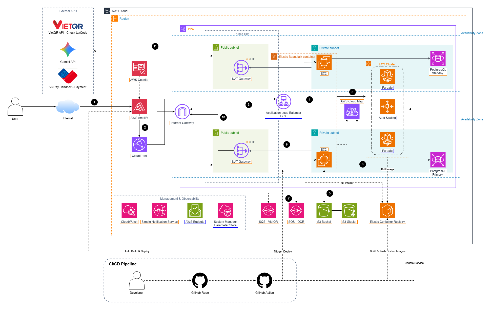

# SmartInvoice Shield
<h2 align="center">Electronic Invoice Risk Management & Auditing System on AWS</h2>

### 1. Executive Summary
SmartInvoice Shield is a specialized SaaS (Software as a Service) system designed to provide a comprehensive solution for Vietnamese enterprises in managing and reviewing e-invoice risks. The platform automates data extraction from various invoice formats (XML, PDF, Images) via AI while executing a 3-layer compliance validation rule set (Structure, Digital Signature, Business Logic) based on Decree 123/2020/ND-CP. 

By leveraging the power of AWS Serverless and Managed Services (Elastic Beanstalk, ECS Fargate, S3, RDS, Cognito, SQS), SmartInvoice Shield delivers low-latency automated processing for large data volumes, ensuring High Availability (Multi-AZ), operational cost optimization, and absolute security.

### 2. Problem Statement
***Current Problem***

In many enterprises, the incoming invoice processing workflow still relies 100% on manual data entry, consuming 5-10 minutes per invoice with an error rate of up to 15-20%. More severely, businesses face immense risks of mistakenly recording invoices from blacklisted companies, fake invoices, or mathematical discrepancies. Under Decision 78/QD-TCT, this brings heavy legal consequences (exclusion of deductible expenses, tax arrears). Existing software solutions mainly offer passive storage without active firewall mechanisms and early warnings.

***The Solution***

SmartInvoice Shield transforms manual workflows into fully automated processes with core features:
- **Collection & Digitization:** Automatically extracts data from original XML invoices and utilizes an AI Engine (AWS ECS Fargate running PaddleOCR/VietOCR) to read and digitize PDF/Image files.
- **3-Layer Validation:** (1) XSD Structure Validation; (2) Digital Signature Authentication & Anti-Spoofing; (3) Business logic verification (math, dates, and VietQR API integration for Tax Code status verification).
- **Secure Storage & Auditing:** Infinite storage on Amazon S3 with AES-256 encryption. Data is protected by an immutable Audit Trail system to track all user changes.
- **Transparency & Alerts:** The system assesses risks using a 3-level visual scale (Green/Yellow/Red), assisting Chief Accountants in making rapid approval decisions.

***Business Value & Business Model***

The system commits to helping businesses cut invoice processing time by 90% and prevent 100% of legal risks before tax filing. With a SaaS model, customers do not need to invest in hardware or IT personnel for operation. Instead, businesses can flexibly subscribe to **Service Packages (Subscriptions)** on a monthly/yearly basis depending on their actual invoice volume. This delivers an immediate Return on Investment (ROI) by completely eliminating administrative fine costs and optimizing the accounting department's time.

### 3. Solution Architecture
The project adopts a Hybrid Architecture combining a Layered Monolith (for the core Backend API) and Microservices (for the AI OCR service), communicating asynchronously via Message Queues.

*AWS Services Utilized*
- **AWS Elastic Beanstalk & ALB:** Provides the core Auto Scaling Group environment for the .NET 9 Backend API, deployed across Multi-AZ for High Availability.
- **AWS ECS Fargate:** The AI processing heart, running as a Serverless Container (Pay-As-You-Go), automatically scaling to zero when there are no invoices to save 100% on idle costs.
- **Amazon RDS for PostgreSQL:** Stores relational data (Multi-AZ) hidden in a Private Subnet, with data encrypted by KMS.
- **Amazon S3:** Stores invoice files (XML, PDF) with SSE-S3 encryption. Integrates Lifecycle Policies to move old data (>90 days) to Glacier Deep Archive.
- **Amazon SQS:** Handles asynchronous queues (Long-polling) for heavy workloads like OCR and tax code verification.
- **AWS Amplify & CloudFront:** Hosting, automated CI/CD, and Edge CDN for the Frontend React SPA application.
- **AWS Cloud Map:** Provides internal Service Discovery, acting as an internal DNS registry. This enables the EC2 Backend to resolve and make direct API calls to the AI OCR Containers, entirely eliminating the need and cost of an intermediate Internal Load Balancer.
- **Amazon Cognito:** Manages identity (Identity Provider), issues JWT Tokens, and secures users according to international standards.
- **AWS Systems Manager (Parameter Store):** An internal vault for securing sensitive information (Database Passwords, API Keys).

### 4. Technical Deployment
*Deployment Phases*

The system is designed for end-to-end deployment on AWS through the following phases:
1. **Networking & Security Setup:** Create a VPC with Public/Private Subnets across 2 AZs. Apply a cost-optimization strategy by eliminating NAT Gateways and locking down security entirely with Security Groups.
2. **Database & Storage Deployment:** Initialize RDS PostgreSQL in the internal network, set up S3 Buckets, and register Docker Images on ECR.
3. **Core & AI Services Deployment:** Launch ECS Fargate Spot for the OCR service and configure Elastic Beanstalk for the .NET Backend. Implement AWS Cloud Map for internal routing and service discovery.
4. **Frontend & Domain Deployment:** Deploy React source code on AWS Amplify.
5. **Monitoring & Management:** Set up CloudWatch Alarms (monitoring CPU, Queue depth, Storage) and SNS Topics for automated alerts.

*Technical Requirements*
- Mastery of the 5 pillars of the AWS Well-Architected Framework.
- Effective application of Docker Containerization.
- Deep understanding of XML data tree structures under Decision 1450/1510/QD-TCT and digital signature hashing algorithms.

### 5. Roadmap & Milestones
The estimated execution time is 3 months (12 weeks) with a team of 5 members (2 Backend Developers, 2 AI Specialist, and 1 Cybersecurity Specialist):
- **Week 1 - 4 (Research & Foundation):** The team focuses on in-depth learning and mastering core AWS services. Simultaneously, the team conducts requirements analysis, designs the System Architecture, and builds the Database Schema.
- **Week 5 - 9 (Core Feature Development):** Starting the implementation of complex modules. Integrating the AI OCR model, building business logic APIs (3-layer validation), and establishing asynchronous communication via Amazon SQS.
- **Week 10 - 12 (Cloud Deployment & Finalization):** Migrating the entire system from the local environment to the AWS Cloud (Production). Setting up CI/CD pipelines, conducting load testing, performing comprehensive security reviews, and finalizing project documentation.

### 6. Estimated Budget
The system applies a **Cost-Optimization Multi-AZ** strategy, eliminating redundant infrastructure components to maximize operational budget savings. Based on the AWS estimation, the costs are as follows.

Based on AWS pricing in the Singapore region (ap-southeast-1), the estimated costs are as follows:

*AWS Infrastructure Costs (Estimated Monthly)*
- **Amazon RDS PostgreSQL (db.t3.micro Multi-AZ):** ~$40.00 USD *(Includes both Primary and Standby nodes)*
- **AWS Elastic Beanstalk (2x EC2 t3.micro + 1 Application Load Balancer):** ~$42.00 USD
- **Amazon VPC (2x NAT Gateways for 2 AZs):** ~$86.00 USD
- **ECS Fargate Spot (AI OCR):** Flexible millisecond billing based on invoice processing (Pay-As-You-Go) (~$7.00 USD).
- **Amazon CloudFront, S3, SQS & Cloud Map:** ~$5.00 USD
- **AWS Amplify & Amazon Cognito:** $0 USD *(Under Free Tier)*

*Total Estimated Cost:* **~$180.00 USD/month** for a highly secure, fault-tolerant Production environment ready to serve enterprises 24/7.

### 7. Risk Assessment
*Risk Matrix*
- AI Recognition Errors (for blurry/torn images): Medium impact, medium probability.
- Latency from 3rd-party APIs (VietQR API overload): Low impact, high probability.
- Sudden Traffic Spikes (End-of-month tax filing): High impact, low probability.

*Mitigation Strategy*
- **For AI:** Provide a "Visual Diagnostic GUI" allowing accountants to compare extracted results with original documents for manual overrides.
- **For External APIs:** Apply the Circuit Breaker design pattern and Retry Pattern with Exponential Backoff to prevent cascading failures.
- **For Traffic:** Auto Scaling Groups to automatically increase EC2 instances (Max 4 nodes) and ECS Tasks (Max 10 tasks) based on the number of backlogged messages in SQS.

*Contingency Plan:*
Utilizing the Multi-AZ architecture allows the system to auto-failover when an Availability Zone (AZ) encounters a hardware failure. RDS data is automatically backed up (Point-In-Time Recovery) combined with 24/7 monitoring via CloudWatch Alarms.

### 8. Expected Outcomes
*Technical Improvements:* The system operates smoothly using an Event-Driven architecture, achieving P95 API latency of < 2s. AI extraction accuracy (Textract/VietOCR) is committed to exceeding 85% for complex Vietnamese invoices. Horizontal Scaling capabilities handle thousands of concurrent invoices.

*Long-term Value:* Provides businesses with a solid "Shield" to digitally transform accounting operations. Completely eliminates physical errors, transparentizes the approval workflow, and builds a perfect data storage repository ready for any tax audits over the next 10 years.