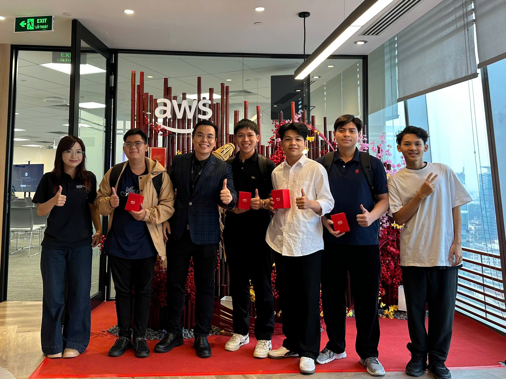
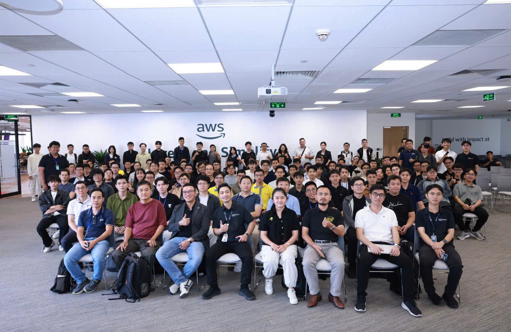

# Báo cáo Sự kiện “AWS re:Invent Recap HCMC 2026”

### 1. Mục tiêu sự kiện
- **Cập nhật công nghệ:** Nắm bắt những công bố mới nhất từ AWS re:Invent toàn cầu, đặc biệt là dòng mô hình Nova, Amazon Bedrock và hạ tầng MLOps.
- **Tối ưu hóa giải pháp:** Khám phá việc triển khai Cơ sở dữ liệu Vector (Vector Databases) và Truy xuất Đa phương thức (Multimodal Retrieval) để giải quyết các bài toán dữ liệu phức tạp.
- **Kết nối cộng đồng:** Trao đổi trực tiếp với các chuyên gia AWS về hiện đại hóa ứng dụng và hạ tầng điểm kết nối mạng (POP) DirectConnect mới tại Việt Nam.

### 2. Diễn giả
- **Prapti Gupta** - Chuyên gia & Diễn giả AWS (Dẫn dắt phiên thảo luận về Vector Database trên S3).
- Các **Kiến trúc sư Giải pháp (Solutions Architects)** từ AWS Việt Nam.

### 3. Những điểm nổi bật chính

**Nền tảng Phân tích và Dữ liệu Hiện đại**
- **Keynote về ML/AI & Đổi mới:** Tầm nhìn chiến lược của AWS nhằm thúc đẩy đổi mới thông qua sức mạnh dữ liệu và Trí tuệ nhân tạo.
- **Cơ sở dữ liệu Vector trên Amazon S3:** Phương thức tối ưu hóa chi phí và quy mô khi lưu trữ/quản lý vector trực tiếp trên S3 cho ứng dụng AI.
- **Ngôn ngữ Truy vấn Tự nhiên trên OpenSearch:** Dùng ngôn ngữ tự nhiên để truy vấn dữ liệu, thu hẹp khoảng cách người dùng với hệ thống phức tạp.

**Hệ sinh thái AI Tạo sinh và Hạ tầng MLOps**
- **Nâng cấp ứng dụng GenAI:** Tận dụng tính năng tối tân từ họ mô hình Nova và Amazon Bedrock để thiết kế ứng dụng thông minh hơn.
- **Quản lý Tài nguyên qua MCP:** Cơ chế tương tác và điều phối các dịch vụ AWS hiệu quả bằng Model Control Plane (MCP).
- **Truy xuất Đa phương thức:** Bước đột phá của Bedrock Knowledge Bases, cho phép tìm kiếm và tổng hợp chéo nhiều loại dữ liệu (hình ảnh, văn bản, bảng biểu).
- **Hạ tầng MLOps quy mô lớn:** Quy trình huấn luyện và triển khai mô hình học máy chuẩn xác trên nền tảng Amazon SageMaker AI.

### 4. Giá trị Đúc kết

**Kiến thức chuyên môn**
- **Luồng Kiến trúc (Architecture Flow):** Nắm rõ dòng chảy xử lý từ lưu trữ (S3), truy vấn (OpenSearch) đến môi trường huấn luyện/thực thi (SageMaker/Bedrock).
- **Sức mạnh Đa phương thức (Multimodal):** Cách kết hợp các luồng thông tin để tối đa hóa độ chính xác của AI.

**Tư duy Hệ thống**
- Hiểu được rằng phát triển AI không chỉ viết code mô hình, mà là kiến tạo một hệ sinh thái hạ tầng đo lường (MLOps) để hệ thống dễ dàng mở rộng.

### 5. Ứng dụng thực tiễn vào Công việc

**Dự án SmartInvoice Shield:**
- Ứng dụng *Multimodal Retrieval* để xử lý hóa đơn đầu vào có độ nhiễu cao (ảnh chụp mờ, file cứng đóng dấu).
- Kế hoạch thay thế/bổ trợ CSDL quan hệ bằng Vector Databases nhằm tăng tốc độ tìm kiếm văn bản liên kết.
- Áp dụng các quy trình MLOps bài bản để quản trị phiên bản mô hình OCR thay vì chép tay thủ công.

### 6. Trải nghiệm Sự kiện
Được tham dự sự kiện tại tháp Bitexco là một trải nghiệm mở mang tầm mắt và cực kì chuyên nghiệp:
- Lắng nghe trực tiếp những chia sẻ nhiệt huyết từ chuyên gia AWS về kiến trúc lưu trữ.
- Cơ hội quý báu để kết nối (networking) với cộng đồng kỹ sư Cloud & AI tại Việt Nam.

### 7. Bài học kinh nghiệm
- Việc hiểu luồng tổng thể kiến trúc quan trọng hơn việc chỉ biết dùng lẻ tẻ từng dịch vụ.
- Tối ưu chi phí ngay từ khâu thiết kế (như dùng S3 thay vì dịch vụ riêng đắt đỏ cho Vector DB) là yếu tố sống còn lúc đẩy lên quy mô lớn.
- Networking không chỉ để làm quen, mà còn để cọ xát, "kiểm chứng" lại các suy luận logic kỹ thuật thông qua người đi trước.

### 8. Một số hình ảnh tại sự kiện

**AWS re:Invent Recap 2026**

**Kỷ niệm cùng cộng đồng AWS Việt Nam**

---
*Nhìn chung, sự kiện re:Invent Recap 2026 đã mang đến cho tôi một "tấm bản đồ" hoàn chỉnh để định hình chiến lược AI dài hạn cho dự án SmartInvoice Shield và con đường sự nghiệp cá nhân.*
