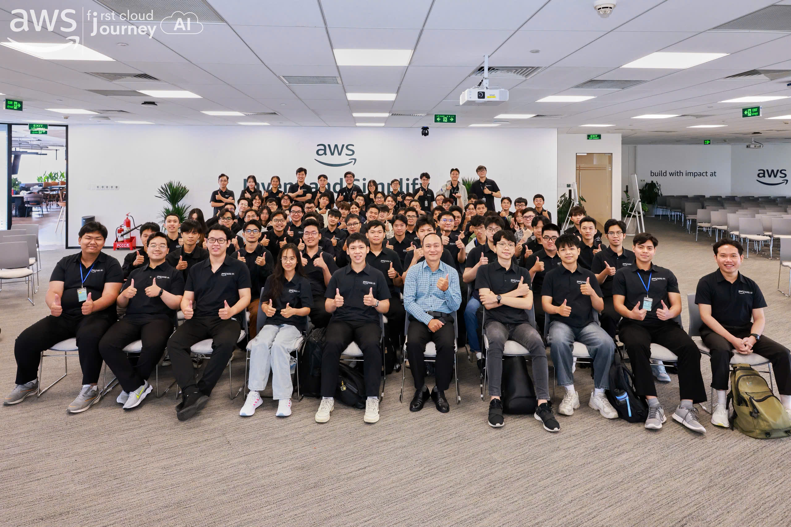
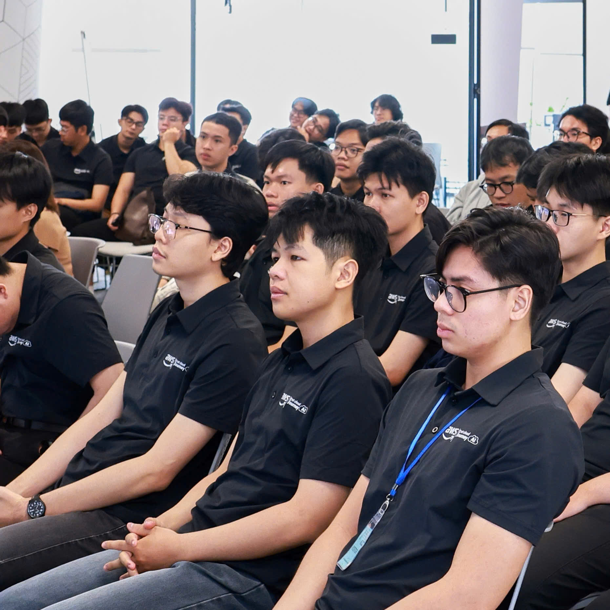

# Summary Report: Platform Engineering & GenAIOps

### 1. Event Objectives
- Explore the role of Platform Engineering in the modern Cloud ecosystem and career path orientation.
- Grasp the core principles of GenAIOps and DevOps specifically for Generative AI applications.
- Learn about new tools and strategies for efficient code deployment in the AI Agent Era (Agentic Era).
- Learn how to build production-ready Multimodal GenAI solutions on AWS.

### 2. List of Speakers
- **Hải Bùi** – Engineering Manager, GoTymeX
- **Phúc Đặng** – Cloud Architect, GoTymeX
- **Pháp Nguyễn** – Cloud Engineer, VPBank
- **Phát Phạm** – Software Engineer, Katalon
- **Nghi Danh** – AI Engineer, Renova Cloud
- **Phong Nguyễn** – Senior Software Engineer, Sympli
- **Thịnh Nguyễn** – DevOps Engineer, FCAJ

### 3. Key Highlights

**Building Modern Platform Engineering & Career Orientation**
- Introduction to Platform Engineering and its indispensable role in the DevOps ecosystem.
- Understanding corporate culture, internship opportunities, and participating in live Q&A sessions with industry experts.

**GenAIOps Essential - DevOps for GenAI Applications**
- Foundational principles of DevOps on AWS and learning materials.
- Practical examples of GenAIOps for AWS projects using Bedrock AgentCore Observability, EKS, and Langfuse.

**Code Deployment in the Agentic Era**
- Analysis of current programming issues and introduction of new supporting tools.
- Deep dive into the Productivity Playbook and live demos of how AI assists in writing code.

**Production-ready Multimodal GenAI on AWS**
- Introduction to the New AI Application Stack.
- Multimodal Search with Nova Embeddings.
- Using GraphRAG for corporate knowledge management and designing Multi-Agent Workflows.
- Methods for ensuring safety and observability for GenAI systems.

### 4. Lessons Learned
- **Technical Thinking:** Platform engineering is the foundation for scaling on the Cloud. The shift to the “Agentic Era” requires a complete change in how code is written, reviewed, and deployed, relying heavily on AI tools to increase productivity.
- **System Architecture:** Bringing AI from the lab to the real world (production) requires GenAIOps. Combining Nova Embeddings, GraphRAG, and Multi-Agent workflows provides a flexible and powerful architecture for handling complex business data.

### 5. Practical Application

**Upgrading the SmartInvoice Shield Project:**
- **Integrating Multimodal Search with Nova Embeddings:** Improving the ability to extract and cross-verify data from complex invoice formats (such as blurry photos or text-heavy PDF files).
- **Implementing Multi-Agent Workflows:** Applying the AI Agent concept (like the OpenClaw model) to handle each step independently in the invoice flow—for example: one agent specialized in reading OCR, one agent specialized in cross-verification and fraud detection.
- **Applying GenAIOps:** Using Bedrock AgentCore Observability and Langfuse to monitor the performance and accuracy of underlying AI models, ensuring stable system operation.

### 6. Event Experience
- **Learning from Multi-disciplinary Experts:** Listening to practical sharing from engineers from GoTymeX, VPBank, and Katalon provides a multi-dimensional perspective on how to apply Cloud and AI in different fields.
- **Accessing Practical Architecture:** Demo sessions on Multimodal GenAI architecture help bridge the gap between calling basic APIs and building a truly enterprise-grade AI system.
- **Expanding Connections:** Open Q&A sessions and breaks were great opportunities to interact, learn from real-world experience, and receive helpful advice for the current Cloud system development internship journey.

### 7. Event Photos

**Platform Engineering & GenAIOps Event**

**Attendee at Event**

---
*Summary: The event provided a clear technical blueprint for building reliable GenAI applications and gave valuable orientations for my software engineering career.*
